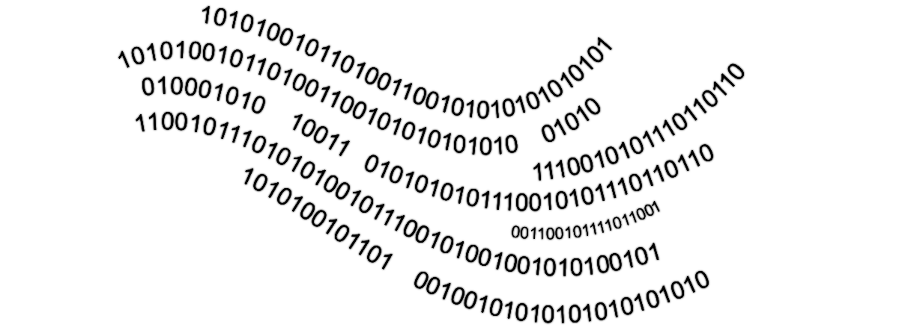

# 🖥️ Bitwise

**`#bs.bitwise:help`**

This folder contains various bitwise operators to
apply to scores.

<div align=center>



</div>

```{button-link} https://youtu.be/itgPhvTMSZQ
:color: primary
:align: center
:shadow:

{octicon}`device-camera-video` Watch a demo
```

<div align=center>

_Friendly advice: decrease the volume before clicking_ 😅

</div>

```{epigraph}
"Binary is a very simple numbering system, but it is incredibly powerful when used correctly."

-- Alan Turing
```

---

## 🔧 Functions

You can find below all the function available in this module.

---

### logical AND

**`#bs.bitwise:and`**

Computes the bitwise conjunction of the two input numbers

Inputs

:  (score) `$bitwise.and.a bs.in`
   : The first operand $a$

   (score) `$bitwise.and.b bs.in`
   : The second operand $b$

   ```{admonition} Negative input
   :class: hint

   If one of the inputs is negative, the operation will be done between
   the first operand and the two's complement of the second
   ```

Outputs

:  (score) `$bitwise.and bs.out`
   : The result of the operation = $a \times b$

Example

:  Calculate and display $-9 \times 57$
   ```mcfunction
   # Once
   scoreboard players set $bitwise.and.a bs.in -9
   scoreboard players set $bitwise.and.b bs.in 57
   function #bs.bitwise:and
   tellraw @a [{"text":"-9 & 57 = ", "color": "dark_gray"},{"score":{"name":"$bitwise.and", "objective": "bs.out"}, "color": "gold"}]
   ```

> **Credits**: theogiraudet, Aksiome

---

### logical OR

**`#bs.bitwise:or`**

Computes the bit to bit disjunction of the two input numbers

Inputs

:  (score) `$bitwise.or.a bs.in`
   : The first operand $a$

   (score) `$bitwise.or.b bs.in`
   : The second operand $b$

   ```{admonition} Negative input
   :class: hint

   If one of the inputs is negative, the operation will be done between
   the first operand and the two's complement of the second
   ```

Outputs

:  (score) `$bitwise.or bs.out`
   : The result of the operation = $a + b$

Example

:  Calculate and display $-9 + 57$.
   ```mcfunction
   # Once
   scoreboard players set $bitwise.or.a bs.in -9
   scoreboard players set $bitwise.or.b bs.in 57
   function #bs.bitwise:or
   tellraw @a [{"text":"-9 | 57 = ", "color": "dark_gray"},{"score":{"name":"$bitwise.or", "objective": "bs.out"}, "color": "gold"}]
   ```

> **Credits**: theogiraudet, Aksiome

---

### logical XOR

**`#bs.bitwise:xor`**

Computes the exclusive bit by bit disjunction of the two input
numbers

Inputs

:  (score) `$bitwise.xor.a bs.in`
   : The first operand $a$

   (score) `$bitwise.xor.b bs.in`
   : The second operand $b$

   ```{admonition} Negative input
   :class: hint

   If one of the inputs is negative, the operation will be done between
   the first operand and the two's complement of the second
   ```

Outputs

:  (score) `$bitwise.xor bs.out`
   : The result of the operation = $a \oplus b$

Example

:  Calculate and display $-9 \oplus 57$.
   ```mcfunction
   # Once
   scoreboard players set $bitwise.xor.a bs.in -9
   scoreboard players set $bitwise.xor.b bs.in 57
   function #bs.bitwise:xor
   tellraw @a [{"text":"-9 ^ 57 = ", "color": "dark_gray"},{"score":{"name":"$bitwise.xor", "objective": "bs.out"}, "color": "gold"}]
   ```

> **Credits**: theogiraudet, Aksiome

---

### logical NOT

**`#bs.bitwise:not`**

Computes the bit by bit negation of the input

Inputs

:  (score) `$bitwise.not.value bs.in`
   : The number you want to negate

Outputs

:  (score) `$bitwise.not bs.out`
   : The result of the not operation

Example

:  Calculate and display $~452$
   ```mcfunction
   # Once
   scoreboard players set $bitwise.not.value bs.in 452
   function #bs.bitwise:not
   tellraw @a [{"text":"~452 = ", "color": "dark_gray"},{"score":{"name":"$bitwise.not", "objective": "bs.out"}, "color": "gold"}]
   ```

> **Credits**: theogiraudet

---

### Bit count

**`#bs.bitwise:bit_count`**

Calculates the number of bits needed to store
the input

Inputs

:  (score) `$bitwise.bit_count.value bs.in`
   : The number you want to know the number of bits

Outputs

:  (score) `$bitwise.bit_count bs.out`
   : The number of bits needed to store the input

   ```{admonition} Negative input
   :class: hint

   If the input is negative, returns the number of bits needed to store
   the absolute value of the number
   ```

Example

:  Calculate and display the number of bits of 12
   ```mcfunction
   # Once
   scoreboard players set $bitwise.bit_count.value bs.in 12
   function #bs.bitwise:bit_count
   tellraw @a [{"text": "Number of bits of 12 = ", "color": "dark_gray"},{"score":{"name":"$bitwise.bit_count", "objective": "bs.out"}, "color": "gold"}]
   ```

> **Credits**: theogiraudet

---

### Complement to 2

**`#bs.bitwise:two_complement`**

Computes the two's complement of the input

Inputs

:  (score) `$bitwise.two_complement.value bs.in`
   : The number you want to compute the two's complement

Outputs

:  (score) `$bitwise.two_complement bs.out`
   : The two's complement of the input

Example

:  Calculate and display the two's complement of 12
   ```mcfunction
   # Once
   scoreboard players set $bitwise.two_complement.value bs.in 12
   function #bs.bitwise:two_complement
   tellraw @a [{"text": "Two's complement of 12 = ", "color": "dark_gray"},{"score":{"name":"$bitwise.two_complement", "objective": "bs.out"}, "color": "gold"}]
   ```

> **Credits**: theogiraudet

---

### Most significant bit

**`#bs.bitwise:msb`**

Get the value of the most significant bit of the input

Inputs

:  (score) `$bitwise.msb.value bs.in`
   : The number you want to compute the msb

Outputs

:   (score) `$bitwise.msb bs.out`
   : The value of the msb of the input

Example

:  Calculate and display the value of the most significant bit of 12
   ```mcfunction
   # Once
   scoreboard players set $bitwise.msb.value bs.in 12
   function #bs.bitwise:msb
   tellraw @a [{"text": "MSB of 12 = ", "color": "dark_gray"},{"score":{"name":"$bitwise.msb", "objective": "bs.out"}, "color": "gold"}]
   ```

> **Credits**: Aksiome

---

<div align=center>

**💬 Did it help you?**

Feel free to leave your questions and feedbacks below!

</div>

<script src="https://giscus.app/client.js"
        data-repo="Gunivers/Glibs"
        data-repo-id="R_kgDOHQjqYg"
        data-category="Documentation"
        data-category-id="DIC_kwDOHQjqYs4CUQpy"
        data-mapping="title"
        data-strict="0"
        data-reactions-enabled="1"
        data-emit-metadata="0"
        data-input-position="bottom"
        data-theme="light"
        data-lang="fr"
        data-loading="lazy"
        crossorigin="anonymous"
        async>
</script>
