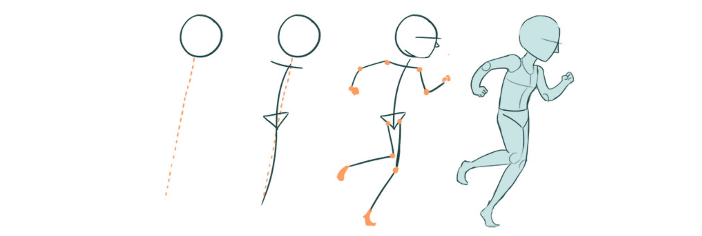

# 🏃 Move

**`bs.move:_`**

Make your entity move exactly the way you want them to!

<div align=center>



</div>

```{button-link} https://youtu.be/KH3Q9F5j04I
:color: primary
:align: center
:shadow:

🎬 Watch a demo
```

> In the universe, everything is mouvement.
>
> -- Heraclite d'Ephès

```{toctree}
:hidden:
:caption: Function configuration

move/by_vector_custom_collision
```

---

## 🔧 Functions

You can find below all the function available in this module.

---

### Move using vector

::::{tab-set}
:::{tab-item} Canonical

**`bs.move:by_vector`**

Allows to move the entity according to its vector on each
axis of the game.

Inputs

:   (execution) `as <entity>`
    : The entity to move

    (scores) `@s bs.vector.[x,y,z]`
    : The local vector you want the entity to move on (respectively left, up and forward vectors), shifted by 3 digits (1000 $\rightarrow$ move by 1 block)

    (scores) `@s bs.collision`
    : The collision behavior. Here is built-in behaviors:

        - `0` (default): The entity will cross all the blocks
        - `-1`: The entity will bounce on all the solid blocks
        - `-2`: The entity will stick and slide on the surface it will encounter
        - `-3`: The entity will stick and stop on all the solid blocks
        - `-4`: The entity will bounce on solid blocks and reduce the total speed by 2
        - `-101`, `-102`, `-103`, `-104` : same but useing head position instead of feet as the source of detection collision.

        ```{button-link} move/by_vector_custom_collision.html
        :color: primary
        :ref-type: doc
        :align: center
        :outline:

        ⚙️ Create your own collisions!
        ```

Option

:   (score) `@s bs.opt.0`
    : Precision of detection (in miliblock, so 500 -> 0.5 block). Default: 1000 (1 block)

Outputs

:   (state) @s position
    : The new position of the entity

Examples

:   Apply a movement of 0.3 blocks per tick in the X direction to all boats (simulating a sea current):

    ```
    # Once
    scoreboard players set @e[type=boat] bs.vector.x 300
    scoreboard players set @e[type=boat] bs.vector.y 0
    scoreboard players set @e[type=boat] bs.vector.z 0

    # In loop
    execute as @e[type=boat] run function bs.move:by_vector
    ```

    Take into account collisions and make the boat stop, with a precision of 0.1 block:

    ```
    # Once
    scoreboard players set @e[type=boat] bs.vector.x 300
    scoreboard players set @e[type=boat] bs.vector.y 0
    scoreboard players set @e[type=boat] bs.vector.z 0
    scoreboard players set @e[type=boat] bs.collision 2
    tag @e[type=boat] add bs.config.override
    scoreboard players set @e[type=boat] bs.precision 100

    # In loop
    execute as @e[type=boat] run function bs.move:by_vector
    ```

```{admonition} How does it work?
:class: dropdown

This function will decompose the input vector in a sum of vectors with max component equal to the desired precision (by default, 1 block).
The vector is a set of 3 scores : `bs.vector.x`, `bs.vector.y`, `bs.vector.y` that define the displacement of the entity
 
The function then use :

$$ V_i = A * V_n + V_r $$

With
- $V_i$ : the input vector
- $V_n$ : The input vector normalize such as it's maximum component is equal to the precision
- $A$  : The number of times Vn need to be stacked to get near $Vi$ ($A \times V_n \approx V_i$)
- $V_r$ : the "rest" vector, that allow to perfectly match $V_i$

Once the vector is decomposed, the system loop from $1$ to $A$ to apply the movement corresponding to the $V_n$ vector, and then apply once the $V_r$ movement.
To apply this vector, the system use a dichotomic function.
Basically, it consist of teleporting the entity to +0.512 on the X axis if the X component of it's vector is > 512
If it's the case, then it remove 512 from the X component. Then repeast the operation with 256 (= 512/2) ... then with 128 (= 256/2)
At the end, the entity will be moved on the X axis by exactly the same distance indicated by the vector component

In each loop before applying the movement, the system call 3 `__switch__` functions that allow to manage collision according to the value of `bs.collision` score.
If the bs.collision score is negative, it will use the built-in collision systems (demo and general purposes).
If the score is positive, it will use the user defined collision, calling the 3 following functions (in order) :
- `bs.config:move/by_vector/collision/heads/__switch__`: Define the detection points
- `bs.config:move/by_vector/collision/detection/__switch__`: Defin the nature of the detection (blocks adjancement)
- `bs.config:move/by_vector/collision/behavior/__switch__`: Define the behavior of the entity when a collision is detected

See the "Create your own behaviors!" dropdown above for more details about collisions. 
```

```{admonition} Dependencies
:class: dropdown

This function depends on:

- [**`bs.location`**](location)
```

```{admonition} Performance tip
:class: tip

Moving an entity using this system is pretty efficient because it only consist in 50 to 100 commands such as scoreboard operation and teleport, which doesn't cost a lot. However, collision detection is from far the heaviest part due to block detection. A higher precision or a higher speed will increase the number of block detection and then the impact on performances.
```

:::
:::{tab-item} Local

**`bs.move:by_local_vector`**

Allows to move the entity according to its vector
on each axis of the local reference frame.

Inputs

:   (execution) `as <entity>`
    : The entity to move

    (scores) `bs.vector.[x,y,z]`
    : The local vector you want the entity to move on (respectively left, up and forward vectors), shifted by 3 digits (1000 $\rightarrow$ move by 1 block)

Outputs

:   (state) @s position
    : The new position of the entity


Example

:   Apply a movement of 0.3 blocks per tick to the left to all boats:

    ```
    # Once
    scoreboard players set @e[type=boat] bs.vector.x 300
    scoreboard players set @e[type=boat] bs.vector.y 0
    scoreboard players set @e[type=boat] bs.vector.z 0

    # In loop
    execute as @e[type=boat] run function bs.move:by_local_vector
    ```

:::
::::

```{admonition} Performance tip
:class: tip

The system does not include any speed limit. However, the
resources consumed by this function are proportional to the number
of blocks/tick at which the entity moves.
```

> **Credits**: Leirof

---

### Move forward

`forward`: Allows to move the entity according to the direction
towards which it looks and its vector `bs.vector.z`

* A vector of 1000 on an axis will cause a movement of one block at each execution of the function.
* The sum of the movements on each axis will give a movement in space (thus in 3 dimensions), corresponding to the global vector of the entity.
* * The system takes as input the 3 scores `bs.vector[Left,Up,Front]` (1000 <=> 1 block).

:::{warning}
The system does not include any speed limit. However, the
resources consumed by this function are proportional to the number
of blocks/tick at which the entity moves.
:::

*Example:*

-   Apply a movement of 0.3 blocks per tick forward to all boats:

    ```
    # Once
    scoreboard players set @e[type=boat] bs.vector.z 300

    # In a loop
    execute as @e[type=boat] run function bs.move:forward
    ```

> **Credits**: Leirof

--- 

### Find a path "as to at"

`pathfind_ata`: Allows to determine a path between the position of the
source entity and the execution position of the function.

* By default, the function will make 500 tests (defined via the `bs.in.1` score). This limit allow to avoid the function taking too many ressources if the path is too complexe or impossible to find.
* The behavior is defined by the variable `bs.in.3` which, by default is 0, corresponding to a behavior of a zombie, creeper, skeleton or a player (terrestrial entity of size 1*2*1).
   * When it is set to 1, the behavior will be similar to a bat.
   * You can create your own behaviors at any time in the `pathfind/config/` folder and link them in the `main.mcfunction` file in the same folder.
* The path is then defined by a succession of armor_stand with the tag "Glib_Pathfind_Rewind" and "Glib_Pathfind".

*Example:*

-   Find the path to the nearest armor_stand:

    ```
    # Once
    execute at @e[type=minecraft:armor_stand,limit=1,sort=nearest] run function bs.move:pathfind_ata
    ```

```{button-link} https://youtu.be/xeLjHIQ0s1Q
:color: primary
:align: center
:shadow:

{octicon}`device-camera-video` Watch the video
```

> **Credits**: Leirof

---

### Convert vector to motion

`vector_to_motion`: Allows to move the entity according to its vector
through a motion (motion system integrated in the game).

* A vector of 1000 on an axis will move a block at each tick of the game.
* The sum of the movements on each axis will give a movement in space (thus in 3 dimensions), corresponding to the global vector of the entity.

:::{note}
This system admits a speed limit corresponding to that of the
Motions. Moreover, the entity will have by default a collision
system preventing it from crossing blocks. Moreover, adding Marker,
NoAI, NoGravity tags can block this system. Collisions are
integrated in this system but are not very reliable and therefore
not recommended. Only activated when the entity has a Collision
score greater than 1 (each value corresponds to a type of
collision). You can modify the collision reactions or create your
own in the `by_vector/config/collision/` folder. By default, the
precision of the collisions, stored on the Var5 score, is 500 (= 0,5
blocks).
:::

> **Credits**: Leirof

---

<div align=center>

**💬 Did it help you?**

Feel free to leave your questions and feedbacks below!

</div>

<script src="https://giscus.app/client.js"
        data-repo="Gunivers/Glibs"
        data-repo-id="R_kgDOHQjqYg"
        data-category="Documentation"
        data-category-id="DIC_kwDOHQjqYs4CUQpy"
        data-mapping="title"
        data-strict="0"
        data-reactions-enabled="1"
        data-emit-metadata="0"
        data-input-position="bottom"
        data-theme="light"
        data-lang="fr"
        data-loading="lazy"
        crossorigin="anonymous"
        async>
</script>