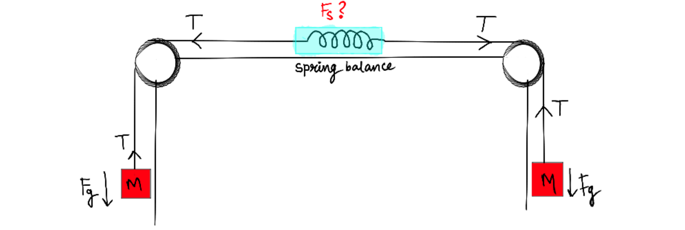

# ↗️ Vector

**`bs.vector:_`**

Vector are fundamental and extremly powerfull tool to manage motions, forces and.. well... do physics!

<div align=center>



</div>


```{button-link} https://www.youtube.com/watch?v=IzASD7R80vQ
:color: primary
:shadow:
:align: center

{octicon}`device-camera-video` Watch a demo
```

```{epigraph}

"With vectors, physics has found a magnificent language."

-- Richard Feynman
```

---

## Get vector from orientation

**`bs.vector:get_from_orientation`**

Compute the displacement vector of the entity according to its orientation. This vector is composed of 3 elementary vectors stored on the scores `bs.vector[X,Y,Z]` (each between -1000 and 1000).

:Inputs:

    (execution) `as <entities>`
    : The entities for which the vector will be computed

:Outputs:

    (scores) `@s bs.vector.[x,y,z]`
    : The vector components

:Example:

    Create, for each Creeper, a vector from their respective orientation

    ```
    # Once
    execute as @e[type=creeper] run function bs.vector:get_from_orientation
    ```

```{admonition} Dependencies
:class: dropdown

This function require the following modules to work properly:
- [`bs.location`](location)
- [`bs.orientation`](orientation)
```

---

## Get vector "as to at"

**`bs.vector:get_ata`**

Compute a vector from the source entity to the execution position of the function.

:Inputs:

    (execution) `as <entities>`
    : The entities for which a vector will be computed, taking there own position as origin

    (execution) `at <entities>` or `positioned <x> <y> <z>`
    : The position of the destination (must be unique)

:Outputs:
    
    (scores) `@s bs.vector.[x,y,z]`
    : The vector components

:Example:

    Create a vector that connects you to the nearest skeleton:

    ```
    # Once
    execute as @s at @e[type=skeleton] run function bs.vector:get_ata
    ```

```{admonition} Dependencies
:class: dropdown

This function require the following modules to work properly:
- [`bs.location`](location)
```

---

## Get length

::::{tab-set}
:::{tab-item} Length

**`bs.vector:length`**

Compute the norm of the vector

:Inputs:

    (execution) `as <entities>`
    : The entities for which the vector will be computed

    (scores) `@s bs.vector.[x,y,z]`
    : The vector components

:Outputs:

    (score) `@s bs.out.0`
    : The vector length

:Example:

    Compute the length of a vector you defined on yourself

    ```
    # Once
    scoreboard players set @s bs.vector.x 1000
    scoreboard players set @s bs.vector.y 2000
    scoreboard players set @s bs.vector.z 3000

    execute as @s run function bs.vector:lenght

    # Display the result
    tellraw @a [{"text":"<"},{"selector":"@s"},{"text":">"},{"text":" Vector length: ","color":"dark_gray"},{"score":{"name":"@s","objective":"bs.out.0"}}]
    ```

```{admonition} Performance tip
:class: tip

If you want to minimize the performance impact, we recomande you to use the `lenght_squared` function instead of this one when it's possible. In fact, computing the lenght of a vector require to perform square root operation which is not a simple task for a computer, especially in Minecraft.

`lenght_squared` can often be used in the following cases:
- You want to compare the length with a given one, then compute manually the square of the given value and compare it with the result of `lenght_squared`, which is faster than computing the real length.
- You want to compare a vector length with another one, then you can compare the result of `lenght_squared` instead of computing the real length of both vectors.
```

```{admonition} Dependencies
:class: dropdown

This function require the following modules to work properly:
- [`bs.math`](math)
```
:::
:::{tab-item} Length squared

**`bs.vector:lenght_squared`**

Compute the norm of the squared vector and store it on the score `bs.out.0`.

:Inputs:

    (execution) `as <entities>`
    : The entities for which the vector will be computed

    (scores) `@s bs.vector.[x,y,z]`
    : The vector components

:Outputs:

    (score) `@s bs.out.0`
    : The vector length squared

:Example:

    Compute the length squared of a vector you defined on yourself

    ```
    # Once
    scoreboard players set @s bs.vector.x 1000
    scoreboard players set @s bs.vector.y 2000
    scoreboard players set @s bs.vector.z 3000

    execute as @s run function bs.vector:lenght_squared

    # Display the result
    tellraw @a [{"text":"<"},{"selector":"@s"},{"text":">"},{"text":" Vector length squared: ","color":"dark_gray"},{"score":{"name":"@s","objective":"bs.out.0"}}]
    ```

:::
::::

---

## Normalize

::::{tab-set}
:::{tab-item} Classic

**`bs.vector:normalize`**

Allows to normalize the components of the vector by putting the length at 1000 (=1 but shited by 3 digits) while respecting the proportions linking these components.

:Inputs:

    (execution) `as <entities>`
    : The entities for which the vector will be normalized

    (scores) `@s bs.vector.[x,y,z]`
    : The vector components

    ```{admonition} Config
    :class: dropdown

    You can configure the length of normalization (which is 1000 by default) by setting the score `vector.normalize.length bs.data` score to the desired value and giving the tag `bs.config.override` to the entity executing the function. Be careful, without this tag, the config score will be reseted to the default value.
    ```

:Outputs:
    
    (scores) `@s bs.vector.[x,y,z]`
    : The normalized vector components

```{admonition} Performance tip
:class: tip

Normalization of vector doesn't often need to be accurate, so you can try first to use the `fast_normalize` function instead of this one. It is less accurate, but it avoid the square root computation so it is faster.
```

```{admonition} Dependencies
:class: dropdown

This function require the following modules to work properly:
- [`bs.math`](math)
```

:::
:::{tab-item} Fast

**`bs.vector:fast_normalize`**

Allows to normalize the components of the vector by placing the largest component at 1000 (=1 but shited by 3 digits) while respecting the proportions linking these components.

:Inputs:

    (execution) `as <entities>`
    : The entities for which the vector will be normalized

    (scores) `@s bs.vector.[x,y,z]`
    : The vector components

    ```{admonition} Config
    :class: dropdown

    You can configure the length of normalization (which is 1000 by default) by setting the score `vector.fast_normalize.length bs.data` score to the desired value and giving the tag `bs.config.override` to the entity executing the function. Be careful, without this tag, the config score will be reseted to the default value.
    ```

:Outputs:
    
    (scores) `@s bs.vector.[x,y,z]`
    : The normalized vector components

:::
::::

---

## Convert canonical to local vector

**`bs.vector:canonical_to_local`**

Allows to convert a "normal" vector (using the relative reference frame) into local coordinates (using the local reference frame)


:Inputs:

    (execution) `as <entities>`
    : The entities for which the vector will be transformed

    (scores) `@s bs.vector.[x,y,z]`
    : The canonical vector components

:Outputs:

    (scores) `@s bs.vector.[x,y,z]`
    : The local vector components

:Example:

    Find the local vector corresponding to the vector X=1000, Y=0, Z=0

    ```
    # Once
    scoreboard players set @s bs.vector.x 1000
    scoreboard players set @s bs.vector.y 0
    scoreboard players set @s bs.vector.z 0
    function bs.vector:get_from_classic_vector

    # Display the result
    tellraw @a [{"text":"<"},{"selector":"@s"},{"text":">"},{"text":" VectorLeft: ","color":"dark_gray"},{"score":{"name":"@s","objective":"bs. vectorLeft"}, "color": "gold"},{"text": "VectorUp: ", "color": "dark_gray"},{"score":{"name":"@s", "objective": "bs. vectorUp"}, "color": "gold"},{"text":" VectorFront: ", "color": "dark_gray"},{"score":{"name":"@s", "objective": "bs.vector.z"}, "color": "gold"}]
    ```

```{admonition} Dependencies
:class: dropdown

This function require the following modules to work properly:
- [`bs.math`](math)
```

---

<div align=center>

**💬 Did it help you?**

Feel free to leave your questions and feedbacks below!

</div>

<script src="https://giscus.app/client.js"
    data-repo="Gunivers/Glibs"
    data-repo-id="R_kgDOHQjqYg"
    data-category="Documentation"
    data-category-id="DIC_kwDOHQjqYs4CUQpy"
    data-mapping="title"
    data-strict="0"
    data-reactions-enabled="1"
    data-emit-metadata="0"
    data-input-position="bottom"
    data-theme="light"
    data-lang="fr"
    data-loading="lazy"
    crossorigin="anonymous"
    async>
</script>